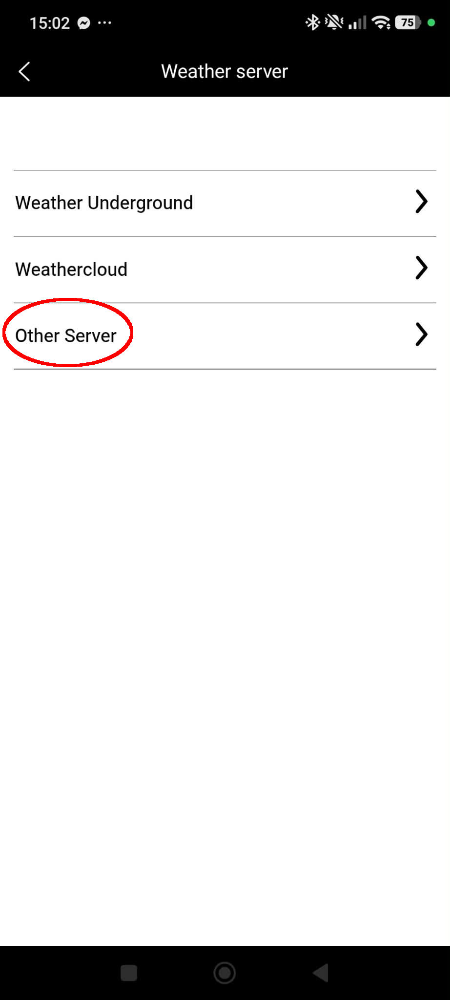
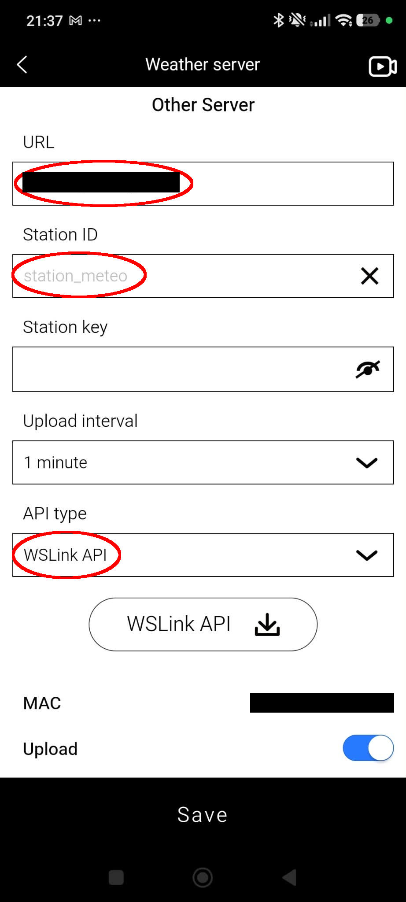
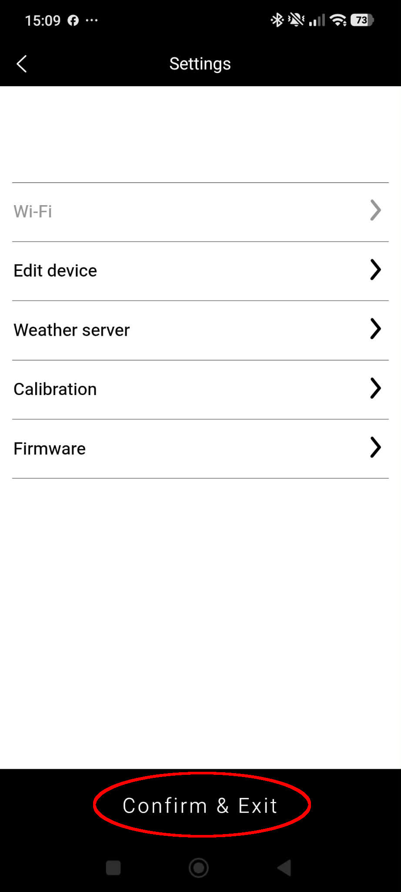

# Personal Weather Station (PWS)

[🇬🇧 English](../readme.md) · **🇫🇷 Français**

[](https://github.com/hacs/integration)
[](https://github.com/MaxensF/personal_weather_station/releases)
[](https://my.home-assistant.io/redirect/hacs_repository/?owner=MaxensF&repository=personal_weather_station&category=integration)

Faites de Home Assistant le serveur vers lequel votre station météo envoie ses
relevés. Pas de cloud, pas de compte, pas d'interrogation : la station poste
directement vers votre instance, et ses appareils et capteurs apparaissent tout
seuls.

---

## Comment ça marche, en un paragraphe

La plupart des intégrations vont chercher la donnée. Celle-ci fait l'inverse :
elle ouvre deux points d'entrée HTTP et attend. Votre station — configurée pour
envoyer vers l'adresse de votre Home Assistant plutôt que vers Weather
Underground — poste ses relevés chaque minute environ, et l'intégration crée un
appareil pour elle et un capteur pour chaque valeur qu'elle reconnaît. **C'est
pour cela qu'il n'y a pas de bouton « ajouter un appareil » :** c'est la station
qui crée le sien.

Les deux protocoles sont pris en charge et peuvent coexister sur la même
instance :

| Protocole | Point d'entrée | Unités |
|---|---|---|
| Weather Underground | `/weatherstation/updateweatherstation.php` | impériales (°F, mph, inHg, in) |
| WSLink | `/data/upload.php` | métriques (°C, m/s, hPa, mm) |

Chaque clé est déclarée avec l'unité de son protocole, donc Home Assistant
convertit vers celle de votre système. Une vitesse de vent WSLink envoyée en m/s
s'affiche en km/h sur un système métrique — c'est correct, pas un bug.

---

## Fonctionnalités

- **Installation guidée.** L'ajout de l'intégration se termine sur les réglages
  exacts à saisir dans votre station, adresse de votre Home Assistant comprise.
  Tant qu'aucune station n'a posté, un message attend avec vous son premier
  envoi.
- **170 capteurs** répartis sur les deux protocoles : température, humidité,
  pression, vent, pluie, foudre, qualité de l'air, capteurs multi-canaux,
  batteries.
- **Calage du nord.** Réaligner une girouette mal orientée au montage, sans
  toucher au matériel.
- **Une station qui cesse d'émettre est marquée indisponible** au lieu d'afficher
  éternellement une valeur figée.
- **Un diagnostic `Dernière réception`** par station, lisible précisément quand
  la station s'est tue.
- **Fuite d'eau et connexion en capteurs binaires**, utilisables avec les cartes
  et alertes de fuite standard.
- **Entités et valeurs conservées au redémarrage** — pas d'attente du prochain
  envoi.
- **Les stations rejetées sont signalées** dans Réparations, au lieu d'échouer en
  silence.
- **Disponible dans les 64 langues que Home Assistant prend en charge.**
- Clé de station facultative.

---

## Prérequis

> [!IMPORTANT]
> **Home Assistant 2025.3.0 ou plus récent.**

La mise à jour depuis une version antérieure de cette intégration est sans
risque : rien n'est renommé ni supprimé de lui-même. Voir le
[changelog](../CHANGELOG.md).

---

## Installation

### HACS

Cette intégration figure dans le magasin HACS par défaut.

1. Ouvrez HACS, cherchez **Personal Weather Station**, téléchargez-la.
2. Redémarrez Home Assistant.
3. **Réglages → Appareils et services → Ajouter une intégration**, cherchez-la.
4. Définissez une **clé de station** si vous en voulez une, ou laissez vide pour
   accepter toutes les stations.

Le dernier écran vous indique exactement quoi saisir dans votre station. Les
mêmes instructions restent accessibles ensuite depuis le ⚙️ de l'intégration →
*Comment diriger une station vers Home Assistant*.

### Manuelle

Copiez `custom_components/personal_weather_station/` dans le
`config/custom_components/` de votre Home Assistant, redémarrez, puis ajoutez
l'intégration comme ci-dessus.

---

## Diriger votre station vers Home Assistant

### Stations Bresser, avec l'application WSLink

Votre station doit déjà être configurée dans l'application et disposer d'un
firmware à jour.

> [!WARNING]
> **Préparez les valeurs avant d'ouvrir l'application, et ne traînez pas sur ces
> écrans.** La station a tendance à perdre sa connexion WiFi si vous mettez trop
> de temps à saisir les paramètres du serveur — et d'autant plus si vous restez
> dans le menu à attendre que les données arrivent dans Home Assistant.
>
> Notez d'abord l'URL, l'identifiant et la clé, remplissez le formulaire d'une
> traite, et appuyez tout de suite sur **Confirm & Exit**. Surveillez l'arrivée
> des données côté Home Assistant, pas depuis l'application.

**1. Ouvrez les paramètres de votre station**


**2. Weather server**


**3. Other Server**



Weather Underground et Weathercloud envoient vers ces services. **Other Server**
est celui qui permet de diriger la station vers votre propre Home Assistant.

**4. Renseignez le serveur**



| Champ | Quoi saisir |
|---|---|
| **URL** | L'adresse et le port de votre Home Assistant, **sans `http://` ni `https://`** — par exemple `192.168.1.100:8123`. Utilisez une adresse que votre station peut joindre **sur votre propre réseau** ; il n'y a aucune raison d'ouvrir un port vers Internet pour qu'une station météo puisse émettre. Si votre station ne résout pas les noms, mettez l'IP. |
| **Station ID** | Ce que vous voulez. Cela devient le nom de l'appareil dans Home Assistant. |
| **Station key** | La clé définie dans l'intégration. Laissez vide si vous n'en avez pas mis. |
| **Upload interval** | 1 minute est une bonne valeur. |
| **API type** | **WSLink** — voir ci-dessous. |
| **Upload** | Activé par défaut — laissez-le ainsi. |

> [!TIP]
> **Préférez WSLink à WUnderground API si votre station propose les deux.**
> Weather Underground est un protocole plus ancien qui n'offre que **4
> emplacements** pour les sondes supplémentaires, et les stations Bresser y font
> passer tous leurs canaux — y compris un thermomètre de piscine — via les champs
> destinés au sol. Une station avec 5 sondes déportées ou plus ne peut tout
> simplement pas les exprimer : le surplus n'atteint jamais Home Assistant, sans
> le moindre message.
>
> | | Weather Underground | WSLink |
> |---|---|---|
> | Paramètres reconnus | 55 | 108 |
> | Canaux de sondes supplémentaires | 4 | 7 |
> | Détecteurs de fuite | — | 7 |
> | Foudre, particules, HCHO/COV, CO₂, CO | — | oui |
>
> Les deux fonctionnent et sont pris en charge ici. WUnderground API n'est le bon
> choix que si votre station ne propose pas WSLink.

Le bouton **WSLink API ⤓** en dessous vous remet la documentation du protocole,
si vous voulez savoir exactement ce que votre station envoie. Elle est aussi
transcrite dans [WSLink API.md](../WSLink%20API.md), jusqu'au dernier paramètre.

Appuyez ensuite sur **Save**.

**5. Confirm & Exit**



> [!IMPORTANT]
> **C'est cette étape qui écrit réellement les réglages dans la station.**
> Appuyer sur *Save* à l'écran précédent ne change rien en soi. Une fois
> **Confirm & Exit** pressé, Home Assistant reçoit les données en quelques
> secondes et vos capteurs apparaissent.

> [!NOTE]
> Certains firmwares Bresser à partir de la **3.02** refusent le HTTP simple.
> Home Assistant doit alors servir du HTTPS sur une adresse que votre station
> peut joindre.

### Toute station gérant le protocole PWS

Dirigez-la vers l'adresse de votre Home Assistant et renseignez :

- **ID** — n'importe quel identifiant ; il devient le nom de l'appareil.
- **Mot de passe / clé de station** — celui défini dans l'intégration, ou rien.

Le point d'entrée accepte un simple GET :

```
http://<home_assistant>:8123/weatherstation/updateweatherstation.php?ID=ma_station&PASSWORD=<clé>&tempf=72&humidity=55
```

- `ID` (ou `wsid`) est **obligatoire** — une requête sans lui reçoit un `400`.
- `PASSWORD` (ou `wspw`) n'est vérifié que si vous avez défini une clé ; une clé
  fausse reçoit un `401` et lève une réparation.
- Les clés inconnues sont ignorées. Une clé envoyée avec une **valeur vide**
  laisse simplement son capteur à `unknown` — le reste de la requête est traité
  normalement.

### Stations qui ne peuvent pas changer d'URL d'envoi

Certaines stations ne parlent qu'à Weather Underground. Deux contournements :

- **L'add-on WSLink** de @schizza, qui intercepte ce trafic et le réexpédie vers
  Home Assistant : [wslink-addon](https://github.com/schizza/wslink-addon).
- **À la main**, en interceptant le trafic vous-même — voir
  [l'issue #20](https://github.com/MaxensF/personal_weather_station/issues/20).

> [!NOTE]
> La version **0.0.7** de l'add-on cassait l'envoi. Le problème a été corrigé en
> **0.0.8** et l'add-on a évolué depuis : utilisez simplement une version à jour.
> Il n'est plus nécessaire de passer par un fork.

---

## Caler le nord

Une station météo doit être orientée au moment de son installation. Si la
girouette n'a pas pu être alignée précisément, toutes les directions du vent sont
décalées d'une même valeur — et il n'y a pas besoin de remonter sur le toit pour
corriger.

Dès qu'une station a remonté une direction du vent, trois commandes apparaissent
sur sa page d'appareil :

| Entité | Rôle |
|---|---|
| `number.<station>_wind_direction_offset` | La rotation appliquée à toutes les directions, de 0 à 359°. Ajustable à la main à tout moment. |
| `button.<station>_set_north_from_current` | Prend la direction remontée à l'instant comme étant le nord. |
| `button.<station>_reset_wind_offset` | Supprime le calage. |

**Procédure :** maintenez la girouette pointée vers le nord **géographique** — pas
le nord magnétique ; vérifiez la déclinaison locale — attendez un envoi de la
station, puis appuyez sur *Définir le nord sur la valeur actuelle*. Le décalage
apparaît dans le curseur et tous les capteurs de direction suivent.

Un capteur de diagnostic `Direction du vent (brute)` continue d'afficher la valeur
non corrigée, ce qui permet de vérifier un calage ou d'en refaire un. Le décalage
est stocké dans les options de l'intégration, et non comme un état restauré :
une purge du recorder ne peut pas le perdre.

> [!NOTE]
> Le décalage s'applique aux valeurs à leur arrivée. L'historique déjà enregistré
> n'est pas réécrit.

Les boutons n'ont pas d'étape de confirmation dans Home Assistant. Si vous
préférez qu'on vous demande, ajoutez-en une dans votre tableau de bord :

```yaml
type: button
entity: button.ma_station_set_north_from_current
confirmation:
  text: La girouette pointe-t-elle vers le nord ?
```

---

## Savoir si une station est vivante

Comme l'intégration ne fait que recevoir, elle n'a aucun autre moyen de
s'apercevoir qu'une station a cessé d'émettre.

- Chaque station reçoit un diagnostic **`Dernière réception`** indiquant son
  dernier envoi. Il reste lisible même quand la station est hors ligne, ce qui
  est précisément le moment où l'on en a besoin. Il utilise l'horodatage du
  message quand l'horloge de la station paraît fiable, et l'heure du serveur
  sinon.
- Passé un délai configurable — **Marquer comme indisponible après**, 15 minutes
  par défaut, `0` pour désactiver — les capteurs de la station passent à
  *indisponible* au lieu d'afficher une valeur figée.

Ce second point compte plus qu'il n'y paraît : une automatisation qui agit sur
une température n'a aucun moyen de distinguer une vraie valeur d'une valeur figée
depuis trois jours.

---

## États de connexion et de fuite

Les états de connexion et de fuite d'eau arrivent sous forme de `1` ou `0`. Ils
sont exposés en **capteurs binaires**, si bien qu'un détecteur de fuite affiche
*Humide* / *Sec* et fonctionne avec les cartes et alertes de fuite standard, et
qu'un état de connexion affiche *Connecté* / *Déconnecté*.

Les niveaux de batterie ne sont volontairement **pas** des capteurs binaires.
Même ceux que le protocole remonte en `Normal=1 / Faible=0` restent des
pourcentages, car c'est là-dessus que reposent les alertes de batterie faible et
les statistiques long terme de Home Assistant.

---

## Quand rien n'apparaît

Une station mal configurée ressemble exactement à une station qui n'a pas encore
posté : une page vide. Pour les distinguer, les requêtes rejetées lèvent une
réparation dans **Réglages → Système → Réparations** :

| Réparation | Signification |
|---|---|
| **Clé de station incorrecte** | La clé de la station ne correspond pas à celle définie ici. Le message nomme la station et l'adresse source. |
| **Aucun identifiant de station** | La station a posté sans `ID` ni `wsid`. |

Une réparation disparaît d'elle-même dès que cette station est acceptée.

Si rien n'apparaît du tout — pas même une réparation — c'est que les requêtes
n'atteignent pas Home Assistant. Vérifiez l'URL, le port, et si votre firmware
exige HTTPS. Et vérifiez que vous avez bien appuyé sur **Confirm & Exit**.

Activer **Journaliser chaque requête reçue** dans les options écrit le contenu
complet de chaque requête dans le journal, le temps de configurer une station.

> [!NOTE]
> Derrière l'add-on WSLink, toutes les stations atteignent Home Assistant via le
> proxy : l'adresse indiquée dans une réparation est donc celle du proxy, sauf si
> vous activez `forward_real_ip` dans l'add-on et `trusted_proxies` dans Home
> Assistant. L'identifiant de station, lui, est fiable dans tous les cas.

---

## Mettre à jour une ancienne installation

Deux choses ont changé pour les nouvelles stations, qui déplaceraient des entités
sur les installations existantes. Aucune ne se produit d'elle-même : chacune est
proposée sous forme de réparation que vous pouvez ignorer.

| Réparation | Ce qu'elle fait | Ce qu'elle coûte |
|---|---|---|
| **Raccourcir les identifiants** | Renomme `sensor.x_x_outdoor_temperature` en `sensor.x_outdoor_temperature` | L'historique et les statistiques long terme suivent le renommage. **Les automatisations, scripts, scènes et tableaux de bord, non** — à vous de les mettre à jour. |
| **Convertir les états** | Transforme les 27 capteurs de connexion et de fuite en capteurs binaires | Un changement de plateforme n'est pas un renommage : les anciennes entités sont supprimées et recréées, et **leur historique brut est perdu**. Ces relevés n'ont pas de statistiques long terme. Tout ce qui les référence doit être mis à jour. |

Jusqu'à la version 1.0.8, le nom de la station apparaissait **deux fois** dans
chaque identifiant, comme dans
`sensor.ma_station_ma_station_outdoor_temperature`. Les stations déjà connues de
Home Assistant conservent ces identifiants — y compris pour les capteurs qui
apparaîtront plus tard, afin qu'une même station ne mélange jamais deux styles de
nommage.

Les identifiants sont construits à partir du nom **anglais** du capteur quelle que
soit votre langue : un tableau de bord partagé entre utilisateurs de langues
différentes continue de fonctionner, même si les noms affichés suivent la langue
de chacun.

---

## Supprimer une station

Une station apparaît d'elle-même dès son premier envoi : une faute de frappe dans
son identifiant crée donc un appareil dont vous ne voulez pas. Un tel appareil se
supprime depuis sa page (**⋮ → Supprimer**) ; il réapparaît automatiquement si
cette station poste à nouveau.

---

## Stations compatibles

Confirmées :

- **Bresser** — 7002586, 7002582, 7002620, 7003300, 7003400, 7004406
- **YOUSHIKO** — YC9471

Toute station capable d'envoyer des requêtes HTTP GET avec des paramètres
correspondant à
[`SENSOR_LIST`](../custom_components/personal_weather_station/const.py) devrait
fonctionner. Si la vôtre marche, une pull request l'ajoutant à cette liste est la
bienvenue.

---

## Développement

```bash
pip install -r requirements_test.txt
pytest tests/ -v
```

| Chemin | Contenu |
|---|---|
| `__init__.py` | Mise en place et points d'entrée HTTP |
| `models.py` | `PwsDevice` et le runtime partagé |
| `entity.py` | Entité de base : nommage, disponibilité, écriture d'état |
| `sensor.py` `binary_sensor.py` `number.py` `button.py` | Les quatre plateformes |
| `registry.py` | Reconstruction des entités depuis les registres au démarrage |
| `migration.py` `repairs.py` | Les deux migrations optionnelles |
| `instructions.py` | Les instructions d'installation, calculées pour l'instance |
| `normalizer.py` | Analyse des valeurs, mise à l'échelle des batteries, décalage du vent |
| `const.py` | `DOMAIN` et `SENSOR_LIST` |
| `strings.json` + `translations/` | Toutes les chaînes visibles par l'utilisateur |

Voir [CONTRIBUTING.md](../CONTRIBUTING.md) — en particulier pour ajouter un
capteur ou améliorer une traduction, qui ne s'éditent ni l'un ni l'autre à la
main.

---

## Licence

Versé au **domaine public** sous [Unlicense](https://unlicense.org).
